# **Simpang Quest by Britney and Her Bodyguards**

**Team:** Moroz Fedor, Shawn Lee, Jing Xian, Hao Wen Chan

**Problem Statement:** Planning an Escape

**Video Presentation:** https://youtu.be/IEvnhiHz9z0

**Presentation Slides:** https://canva.link/7fo68zq0ehs1m0f

**Deployed Web:** https://simpang-quest.vercel.app

---

## **1. Project Overview**

### The Problem

Planning a trip alone is a chore. Planning one **as a group** is a negotiation
that usually collapses before it starts.

The causes, as we understand them:

- **Constraints live in six different heads.** One person is vegan, one uses a
  wheelchair, one can only take four days off, one is broke, one wants beaches
  and one wants museums. Nobody has the full picture, so the plan is built from
  whoever argues hardest rather than from what actually fits.
- **The group has to solve the constraint problem itself.** Existing tools ask
  for the *answers* (give us your dates, your budget, your destination) when
  those answers are exactly what the group cannot agree on. The hard part is
  handed back to the user.
- **Nobody can see why a plan is the way it is.** When the itinerary appears,
  there is no way to tell whether it respected the wheelchair user or quietly
  ignored them, so trust never forms and the group re-litigates everything.

**Stakeholders:** the group of friends or family taking the trip (primary, and
in particular the members whose constraints are easiest to overlook: dietary,
accessibility, budget); the one person who ends up as de-facto organiser and
absorbs the coordination cost; downstream, the local operators, hosts and
transport providers who are only discoverable if a planner surfaces them.

**What exists today, and why it falls short:**

| Existing tool | Why it does not solve this |
| :---- | :---- |
| **Google Travel / Maps lists** | Excellent at *a place*, indifferent to *a group*. Saved lists have no notion of six people's constraints, so reconciling them stays a manual, off-platform argument. |
| **Wanderlog, TripIt** | Strong collaborative itinerary *editors*. They organise a decision after it has been made. The group still has to agree on dates, budget and radius by hand; the tool records the outcome rather than deriving it. |
| **ChatGPT / generic LLM planning** | Will happily produce an itinerary, but it is a wall of text with no map, no verifiable constraint handling, and no way to ask "why is this here?" It also hallucinates opening hours and places. |

### Our Solution

Simpang Quest inverts the input. **Nobody describes the trip. Everyone describes
themselves.** Each traveller fills in a D&D-style character sheet, and Gemini
works out the trip's terms from the overlap between those sheets: when the group
can actually go, how far it can range, what it can spend. The result is
presented as a quest on a hand-drawn map of Peninsular Malaysia, where the plan
assembles itself node by node in front of you.

Feature set:

- **Character sheets, not forms.** Age, diet, accessibility needs, interests,
  free dates, the longest trip you will commit to, regions you actually want to
  reach, and your personal budget.
- **Derived trip terms.** Dates, duration, origin, travel radius and total
  budget are worked out from the party and are **not editable**, because typing
  them in is exactly the problem we removed. A "Why" panel explains where every
  figure came from and links back to the traveller responsible.
- **A living map.** A real Google Maps object with a painted fantasy overlay,
  custom markers, and routes that ink themselves in dash by dash.
- **Grounded, not invented.** Places, hours and prices come from Gemini's Map
  grounding, and seasonal advice from Search grounding, so the itinerary
  describes somewhere that is actually open.
- **Real travel legs.** Routes follow actual road geometry; sea and air hops are
  broken through the nearest real airport or ferry terminal, with a fare.
- **Quest Journal.** The itinerary grouped by day, with per-day cost and hours,
  and a manual status for each stop.
- **Forces Majeure.** Mark a stop closed and the planner finds a comparable
  alternative, swaps it in, and rebuilds the route, with an undo.
- **Explainable scoring.** Every place carries a "Why it's a good fit" checklist
  derived from the actual scoring rules, including the reasons it *fails*.

**What actually changes.** Today: a group chat that runs for two weeks, a
spreadsheet maintained by whoever cared most, a budget nobody agreed to, and the
vegan in the party finding out about the restaurant on arrival. With Simpang
Quest: six people spend three minutes each on their own sheet, and the plan that
appears *cannot* contain a non-vegan-only food stop, *cannot* run past the
shortest commitment in the group, and *cannot* exceed the money actually
brought, because those are hard rules in the engine, not suggestions. The
argument does not get resolved faster; it stops being necessary.

---

## **2. Ideation & Process**

### **2.1 Ideas We Considered**

Our most consequential decision was to **abandon a working project and start
over**. Version one had a complete backend with a real AI integration, but the
concept was unremarkable and the interface gave a judge nothing to react to.
After consulting our mentor we restarted, deliberately trading backend
completeness for a distinctive, fully-realised experience.

| Idea | Why it was dropped / kept |
| :---- | :---- |
| **Character sheets instead of a trip form (Chosen)** | The core insight. Group constraints are the actual problem, so the input should be *people*, not a trip. Everything else in the product follows from this. |
| **Fantasy adventure-map presentation (Chosen)** | Directly answers the mentor's critique. A map you want to look at makes an otherwise dry constraint-solver legible and memorable, and the quest metaphor maps cleanly onto real concepts: party, journal, route, setbacks. |
| **Derived, read-only trip terms (Chosen)** | Kept after we noticed the panel was still hand-editable, which contradicted the entire premise. If the user can type a budget, we have handed the hard problem back to them. |
| **Explainability as a feature (Chosen)** | Kept because a plan nobody trusts gets re-argued. Every derived number and every scored place states its reasoning, including negative reasons. |
| **Project v1: conventional planner with a full AI backend** | Dropped. Technically solid but visually and conceptually forgettable. We judged that a strong idea shown well beats a weak idea implemented completely. |
| **Planning in the browser, on the user's own key** | Dropped. It exposes the model key, makes every keystroke a paid call, and ties plan quality to whatever quota the user happens to have. Planning runs server-side and the result is cached per party. |
| **A chat interface over the planner** | Dropped. Conversation is the wrong shape for a group: six people cannot take turns in a prompt, and the answer arrives as prose you cannot verify. The map is the interface; the reasoning is shown beside it, not typed into it. |
| **Auto-booking flights and hotels** | Dropped. Partner integrations and payments are a product in themselves and would consume the whole build phase. We show fares instead of transacting. |
| **Worldwide coverage** | Dropped. One beautifully-rendered region beats a global map with nothing on it; the calibrated art only exists for Peninsular Malaysia. |

### **2.2 Ideation Boards**

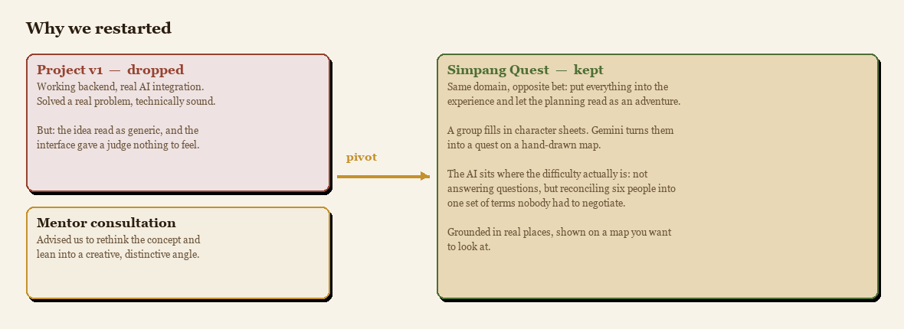

*The pivot. What we gave up (a working AI backend), what the mentor pushed us
towards, and the bet we made instead.*

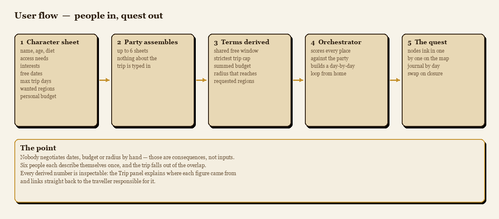

*The user flow, and the single idea it is built around: dates, budget and radius
are consequences of the party, never inputs to it.*

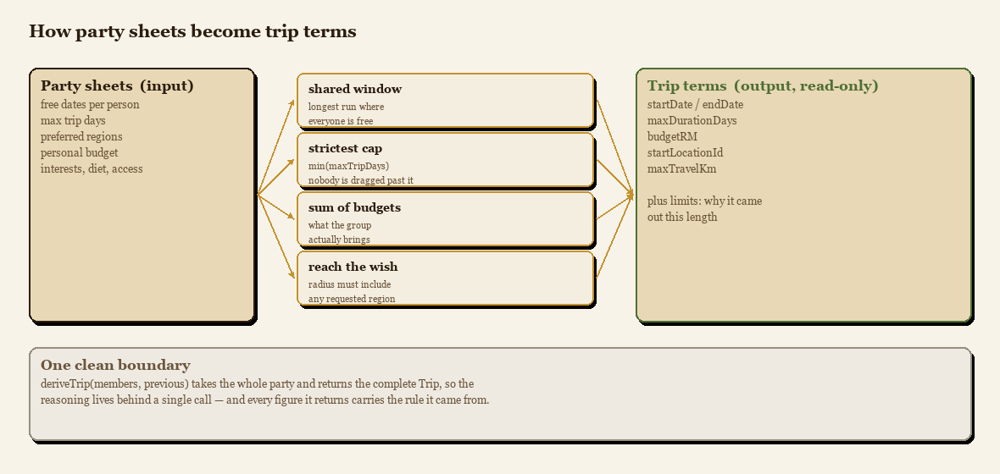

*The derivation rules in detail. Each rule turns something personal into
something collective, and the whole function is the first seam a real agent
takes over.*

### **2.3 Mentor Consultation**

| Date | Mentor | Feedback Received | What Was Changed |
| :---- | :---- | :---- | :---- |
| 11 Sep | Sim Hong Bing | Our first project was technically complete but the idea was not interesting and the visual presentation was weak. Advised rethinking the concept and taking a more creative approach. | We restarted the project. Kept the travel-planning domain but rebuilt it around group character sheets and an adventure-map presentation, and put the AI where it actually removes work, deriving the trip from the party, rather than bolting a chatbot onto a form. |

---

## **3. Design & Prototype**

**UI Prototype:** https://simpang-quest.vercel.app

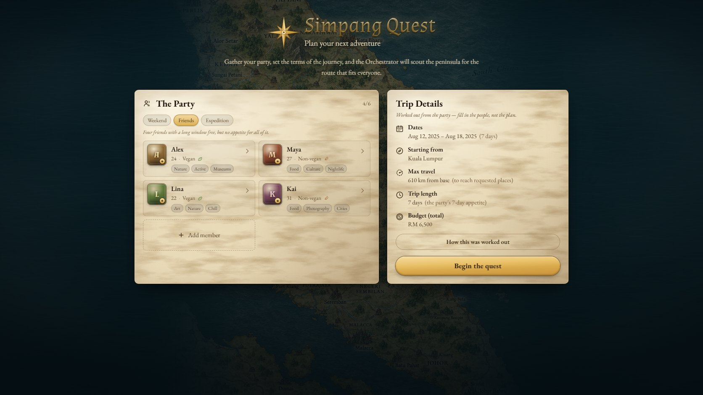

*Onboarding. The party is the only thing you fill in. The Trip Details panel
beside it is already showing values derived from the four seeded sheets.*

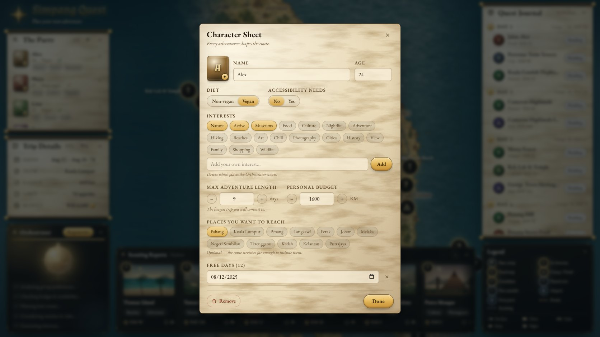

*A character sheet. Interests, free days, accessibility and diet, the longest
trip this person will accept, the regions they want, and their own budget.
Editing any field re-derives the trip immediately.*

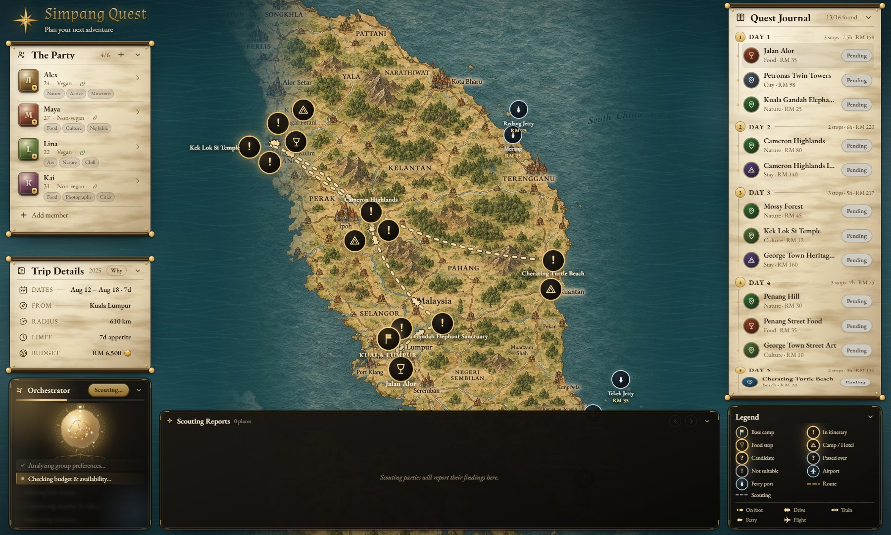

*Mid-generation. Nodes resolve one at a time and the gold route inks itself in
leg by leg. Here it has reached Cherating while the south of the peninsula is
still being scouted.*

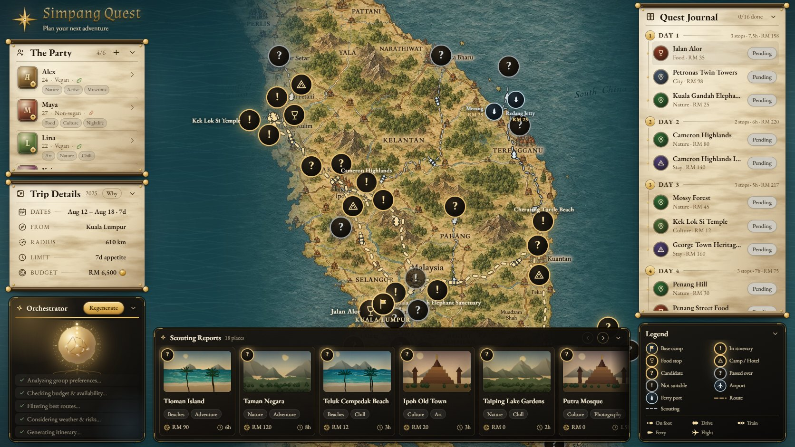

*The finished board. Gold dashes are the confirmed loop out from and back to
base camp; grey dashes are places that were scouted and set aside. Glyphs on
each leg show how that stretch is travelled and point the way you are going.*

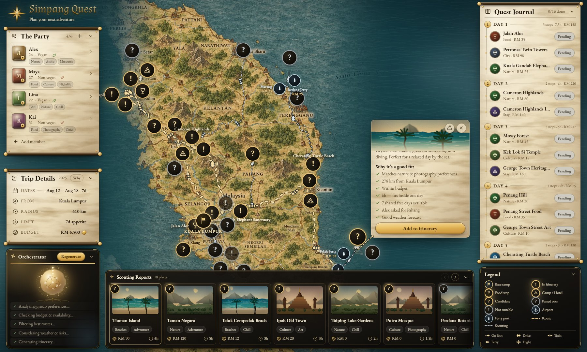

*Clicking a node unfurls its card from the node itself, with a tether back to
it. "Why it's a good fit" is generated from the rules that actually chose it.
Note "Alex asked for Pahang", which traces the stop back to the person who
wanted it.*

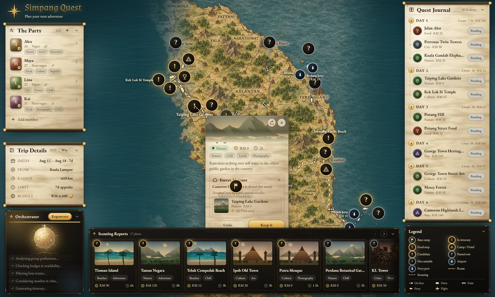

*Forces Majeure. Cameron Highlands is reported closed; Taiping Lake Gardens, 82
km away, same tags and inside budget, is swapped into the route automatically
and the loop re-orders around it. Undo is one click.*

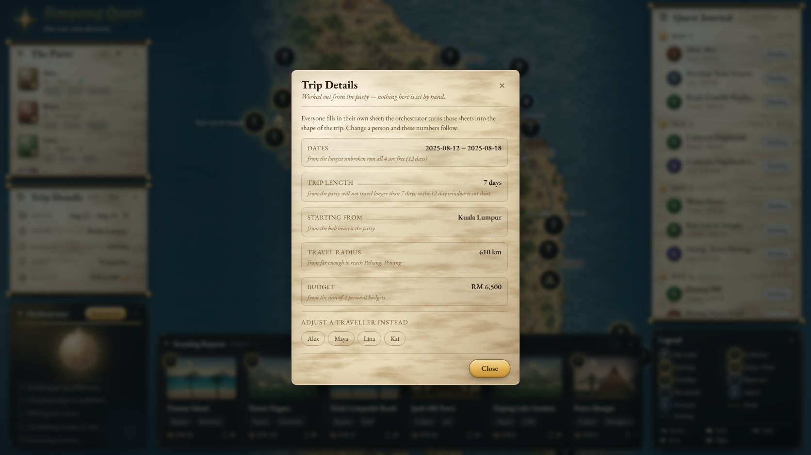

*The "Why" panel. Every trip figure states the rule that produced it and links
straight to the traveller behind it. Nothing here is editable.*

---

## **4. What Makes It Different**

- **The input is inverted.** Every comparable tool asks for the trip and makes
  the group reconcile itself. We ask for the people and let the trip be the
  output. Trip terms are not merely pre-filled. They are **not editable at
  all**, because a field the user can override is a problem handed back.

- **The AI is pointed at the hard part.** Most travel products bolt a chatbot
  onto a form and still expect you to supply the dates and the budget. We put
  the model where the actual difficulty is, reconciling six people's constraints
  into one set of terms, and keep the interface a map rather than a text box.
  Grounding means it answers about real places with real hours, not plausible
  ones.

- **Constraints are binding, not advisory.** A vegan in the party removes
  non-vegan-only food stops from the map. A wheelchair user removes inaccessible
  sites. The shortest `maxTripDays` in the group caps the trip even when a
  longer window exists. These are hard rules in the scoring engine, and the UI
  shows which rule excluded a place.

- **Every number is interrogable.** Trip terms explain their own derivation;
  places explain their score, including the reasons they fail. The plan argues
  its case rather than asserting it.

- **The journey is physically honest.** A sea crossing is not a straight line
  between two beaches. The route drives to a real ferry terminal or airport,
  crosses with a fare attached, and drives on. Transport mode is a stored
  decision per leg: named pairs are set explicitly, the rest fall back to a
  rule, and nothing downstream ever re-derives a mode from geometry. Sea and air
  crossings are pinned by type, so open water can never be labelled as a train.

- **The interface is the argument.** A hand-painted map, routes that ink in dash
  by dash, markers that fan apart when they collide so every one stays
  clickable. Group logistics is a dull problem; presenting it as a quest is what
  makes people willing to engage with it.

---

## **5. Technical Architecture & Feasibility**

### Tech stack

**Frontend: React 19 + TypeScript + Vite.** Vite for near-instant HMR on a
visually iterative project; TypeScript because the domain has a real model
(party, trip, legs, hubs) that we did not want to hold in our heads.
*Constraint:* no SSR, so the first visit pays for the map bundle and the overlay
image before anything is interactive; we preload the art and fade it in.

**State: Zustand.** One store as the single source of truth for party, trip and
plan, so any edit re-derives the trip and re-runs the planner through one path.
Chosen over Redux for the amount of ceremony, and over Context because the plan
recomputes often enough that we wanted selector-level subscriptions.
*Constraint:* a plain store keeps no history, so the Forces Majeure undo is
hand-written and does not generalise. Once edits arrive over Realtime we will
need explicit conflict handling that a local-only store does not give us.

**Styling: Tailwind CSS v4.** The whole theme is CSS custom properties in one
`@theme` block, which made the parchment/gold/ocean palette consistent across
every panel. *Constraint:* v4 is recent enough that parts of the plugin
ecosystem have not caught up, so we stay on the core utilities and write the
ornamental pieces (the scroll rods, the torn edges) by hand.

**Motion: Framer Motion,** for the reveal, the roll-up panels and the stroke-on
route drawing.

**Maps: Google Maps JavaScript API** (`@react-google-maps/api`). A real map
object with real pan, zoom, projection and restriction, carrying our painted art
as a `GroundOverlay` pinned to calibrated bounds, and the Directions service for
real road geometry. *Constraint:* the Directions service is rate-limited and
answers nothing for island hops, so lookups are serialised, cached for the
session, and fall back to a drawn curve. The browser key must be
domain-restricted before any public deploy.

**Backend: Supabase (Postgres + Auth + Realtime).** Chosen for the free tier and
because it gives us the three things this product needs without three services:
Postgres for parties, sheets, trips, itineraries and journal state; Auth so each
traveller owns their own sheet rather than one person typing in everyone's
constraints; Realtime so a party fills itself in simultaneously. *Constraint:*
the free tier pauses idle projects and row-level security has to be written
carefully, because a party member must read the whole party but write only their
own sheet.

**AI: Google Gemini.** Chosen specifically for its grounding tools, which line
up with this problem: **Map grounding** gives real places, hours and closures
instead of a fixture file, and **Search grounding** brings in current events,
prices and seasonal advice. Staying inside Google also keeps map and model on
one key and one billing account. *Constraint:* grounded calls are slow and
quota-limited, so planning runs server-side and the result is cached per party
rather than re-requested on every keystroke.

**Hosting: Vercel.** Static frontend on the edge, with serverless functions for
the Gemini calls so the model key never reaches the browser. *Constraint:* this
is the sharpest conflict we foresee. Serverless functions have a hard execution
limit, while grounded Gemini calls are slow. Planning will have to stream or run
as a background job writing back to Supabase, rather than resolving inside a
single request.

### System architecture diagram

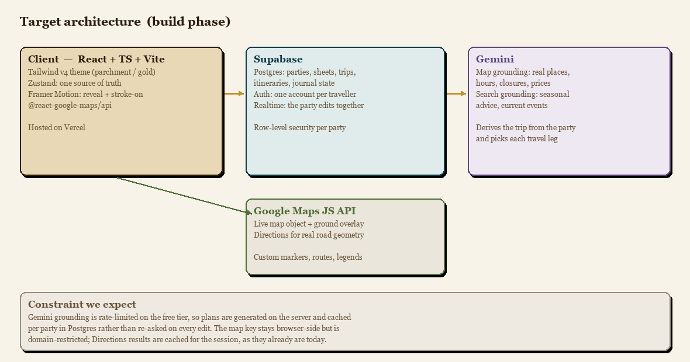

### Build plan & scope

The frontend is built: the map, the character sheets, the derivation, the quest
journal, the routing and every interaction shown in section 3. The three weeks
of the building phase go into the parts that make it a product rather than a
single-session experience, in this order:

1. **Persistence and accounts.** Supabase schema for parties, sheets, trips and
   itineraries; Auth so each traveller owns their own sheet instead of one
   person typing in everyone's constraints; a shareable party link.
2. **Gemini derives the trip.** `deriveTrip(members, previous)` takes the whole
   party and returns the complete `Trip`, so it is a clean boundary: the call
   moves behind a serverless function and the rest of the app is untouched. The
   model weighs whose constraints bind and why, and returns the reasoning the
   "Why" panel already knows how to display.
3. **Grounded places.** Gemini **Map grounding** replaces the curated
   dataset, so opening hours, closures and prices are live rather than authored;
   **Search grounding** adds seasonal advice and current events. The `Poi`
   interface stays as the contract, so the map, scoring and journal need no
   changes.
4. **Gemini chooses transport.** `decideLandMode()` is already a per-leg
   decision stored on the leg rather than a geometric guess, so the model fills
   it in with real knowledge of which routes have a train, a ferry, or only a
   road.
5. **Real-time party editing.** Supabase Realtime so six people fill in their
   sheets at once and watch the quest reshape itself.

Explicitly **out of scope** for the build phase: booking or payments, coverage
beyond Peninsular Malaysia, and a native mobile app. We would rather ship the
five items above working end-to-end than half-build ten.

That geographic limit is a matter of finish, not architecture. Nothing in the
engine knows about Malaysia. `Poi` is a generic shape, and the map calibration
is a reproducible script (`scripts/gen-map.py`) that fits any painted backdrop
to real coordinates from a handful of reference points. Once step 3 replaces the
hand-written dataset with Gemini Map grounding, a new region costs one piece of
artwork and one set of bounds rather than new code.

---

## Running it

```bash
npm install
npm run dev      # http://localhost:5273
npm run build    # type-check + production bundle
```

A Google Maps browser key is required in `.env` as `VITE_GOOGLE_MAPS_API_KEY`.

`SUMMARY.md` documents the engine in detail: the scoring rules, the routing, and
how the map art was calibrated to real coordinates.